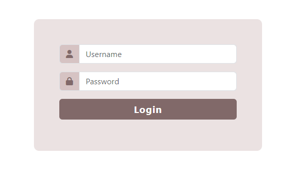

## Description
This repository contains a simple PHP login system that demonstrates the use of sessions for authentication. The system includes three main components:
- [Login Page](login.php) : Users can enter their username and password to log in. The system checks the credentials against a hardcoded username ("user") and password ("1234") for simplicity.
- [Session Page](session.php) : A protected page that can only be accessed by logged-in users. If a user tries to access this page without logging in, they are redirected to the login page.
- [Logout Page](disconnection.php) : Allows users to log out by destroying the session and redirecting them to the login page.

## Features:
- Uses PHP sessions for user authentication.
- Minimalistic design with Bootstrap for styling.
- Secure password storage with password hashing (not implemented in this example for simplicity).
- Basic error handling for incorrect login credentials.

## Screenshots
 
